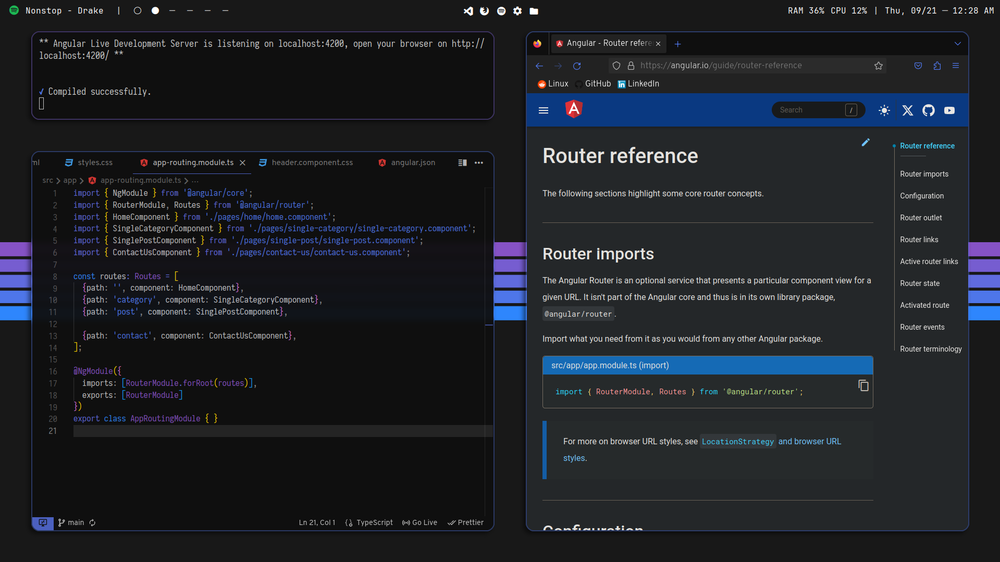
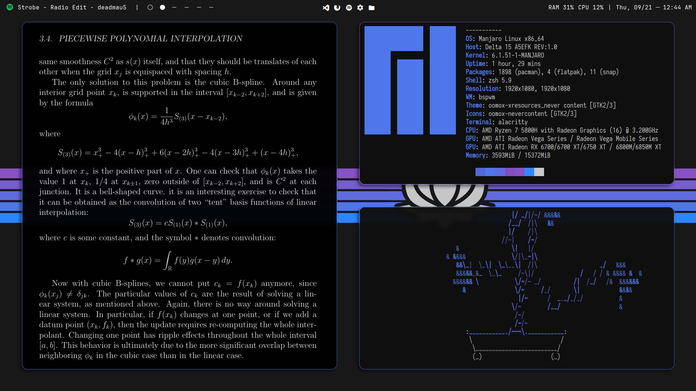

# BSPWM Setup
After endlessly modding config files striving for the perfect harmony between usability and aesthetics I feel like I have finally achieved my perfect Manjaro setup. I've been using this setup as a daily driver and development environment for a few months now without changing much and I really enjoy using it.   
### Screenshots:

  &nbsp;  &nbsp;
  &nbsp;  &nbsp;
  &nbsp;  &nbsp;
  &nbsp;  &nbsp;

  
### System Information:

These are some of the applications that I use in my current setup. 

- **Distro**: Manjaro Linux 6.1.51-1
- **Window Manager**: [bspwm](https://github.com/baskerville/bspwm)
- **Hotkey daemon**: [sxhkd](https://github.com/baskerville/sxhkd)  
- **Shell**: [zsh w/autofill extension](https://ohmyz.sh/) 
- **Compositor**: [picom](https://github.com/yshui/picom) (OG, no fork)
- **Terminal**: [alacritty](https://github.com/alacritty/alacritty)  
- **App Launcher/Powermenu**: [rofi](https://github.com/davatorium/rofi)   
- **Panel**: [polybar](https://github.com/polybar/polybar)
- **Text Editor**: [VS Code](https://github.com/microsoft/vscode)
- **PDF Viewer**: [zathura](https://pwmt.org/projects/zathura/) 
- **File Manager**: [thunar](https://wiki.archlinux.org/title/thunar)

### Application themes and extensions:

These provide for system-wide theme consistency based off the current wallpaper. See [pywal](https://github.com/dylanaraps/pywal).

- **Firefox**: [pywalfox](https://github.com/frewacom/pywalfox)  
- **Spotify**: [spicetify](https://spicetify.app/)  
- **Discord**: [BetterDiscord](https://betterdiscord.app/) to allow custom CSS themes, [pywal-discord](https://github.com/FilipLitwora/pywal-discord) to apply current wal color scheme.
- **GTK**: [oomox](https://github.com/themix-project/oomox) & [lxappearance](https://archlinux.org/packages/community/x86_64/lxappearance/)

### Fonts:  
- Iosevka, JetBrains Mono, SFNS Display
- Icons: FontAwesome & Material Icons 

